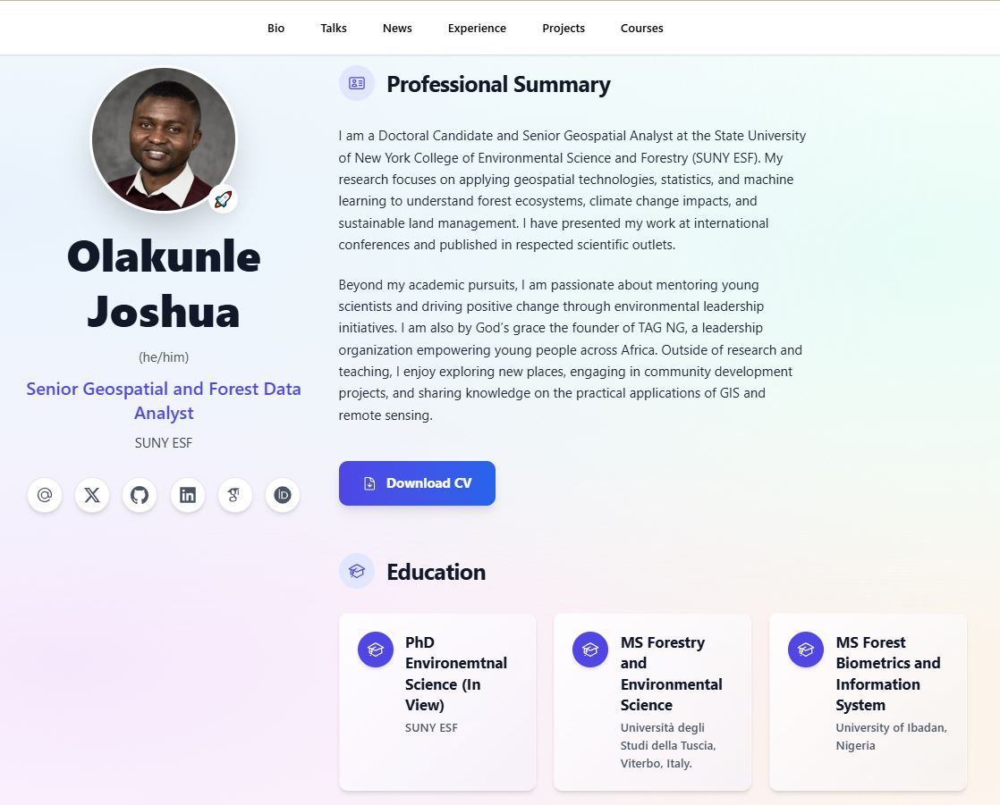

# [The Academic CV That Gets You Hired](https://github.com/HugoBlox/theme-academic-cv)

<h1 align="center">Build an Academic CV and Resumé That Stands Out</h1>

  <strong>Your unfair advantage in academia and tech.</strong> 
  Showcase your work, boost your citations, and land your dream job at places like <strong>Meta, Google, and Stanford</strong>.

---

TAG NG © 2025-Present [Olakunle Joshua](https://tagng.org)

<!--START_SECTION:news-->
<!--Updated at 2025-09-28T01:57:49.232Z-->
<!--END_SECTION:news-->
